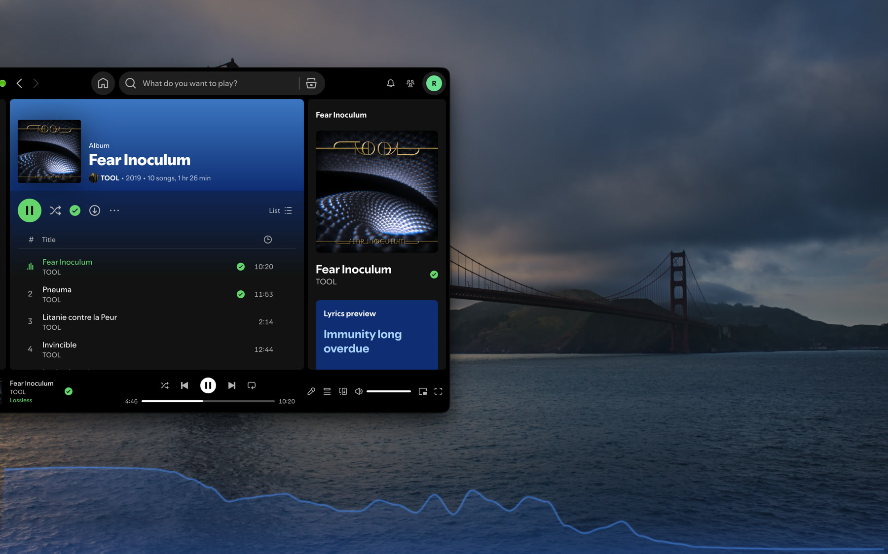

# Bassline

Version 0.2.0 | 2026-09-19 | Author: NorEliYehShi | License: MIT

Bassline is a macOS menu bar visualizer for Spotify audio. It
renders a subtle, animated spectrum strip along the bottom of the selected
screen.



## Requirements

- macOS 14.2 or later
- Spotify for macOS
- Swift 5.10+ and Xcode Command Line Tools

## Run

```bash
git clone https://github.com/NorEliYehShi/Bassline.git
cd Bassline
bash scripts/run.sh
```

On first launch, grant **System Audio Recording** permission. Bassline analyzes
Spotify audio in memory only. It does not record, store, or transmit audio.

## Build

```bash
bash scripts/build_app.sh
```

The app bundle is created at `build/Bassline.app`.

## Controls

Click the waveform icon in the menu bar:

| Setting | Range | Default |
|---|---|---|
| Screen | any connected display | main display |
| Style | Wave / Dots / Aurora | Wave |
| Color | Auto (adapts to wallpaper) / Light / Gray / Dark / Accent | Auto |
| Opacity | 10% – 100% | 60% |
| Height | 40 px – half the screen height | 80 px |
| Sync offset | -300 – +300 ms | 0 ms |
| Low Power Mode | on / off | off |
| Launch at Login | on / off | off |

The menu also shows the current state (waiting for Spotify, connecting,
permission needed, idle, visualizing).

## How it works

```
Spotify → Core Audio process tap (CATapDescription)
       → private aggregate device + IOProc (512-frame buffer)
       → ring buffer → vDSP FFT (1024 samples, Hann window, 512-sample hop)
       → 48 log-spaced bands (40 Hz – 18 kHz), dB scaling + tilt + slow AGC
       → lock-free frame ring, timestamped
       → presented at (display time − output latency − sync offset)
       → CADisplayLink → Metal fragment shader (CAMetalLayer)
       → borderless click-through NSWindow at the bottom of the chosen screen
```

Output latency comes from the active output device (device and stream latency,
safety offset, buffer size), so Bluetooth headphones stay in sync on their own.
The Sync offset slider fine-tunes on top of that.

## Limitations

- One screen at a time
- Spotify only, not system-wide audio
- Not sandboxed, not App Store ready
